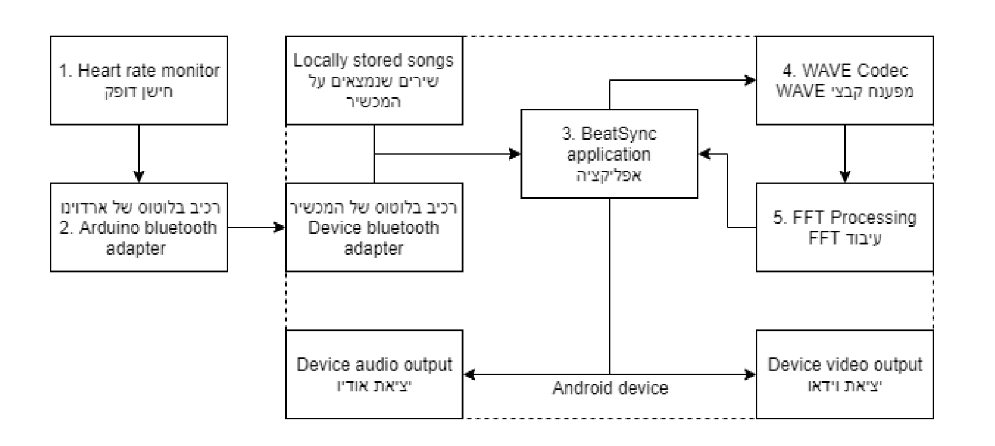
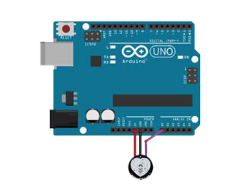
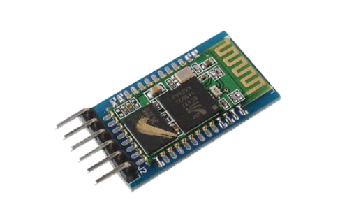
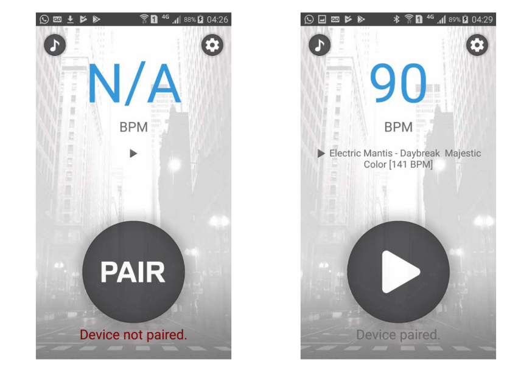
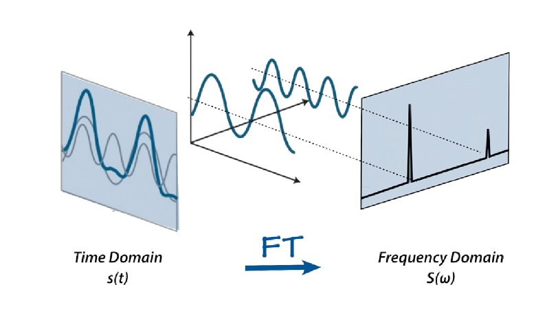
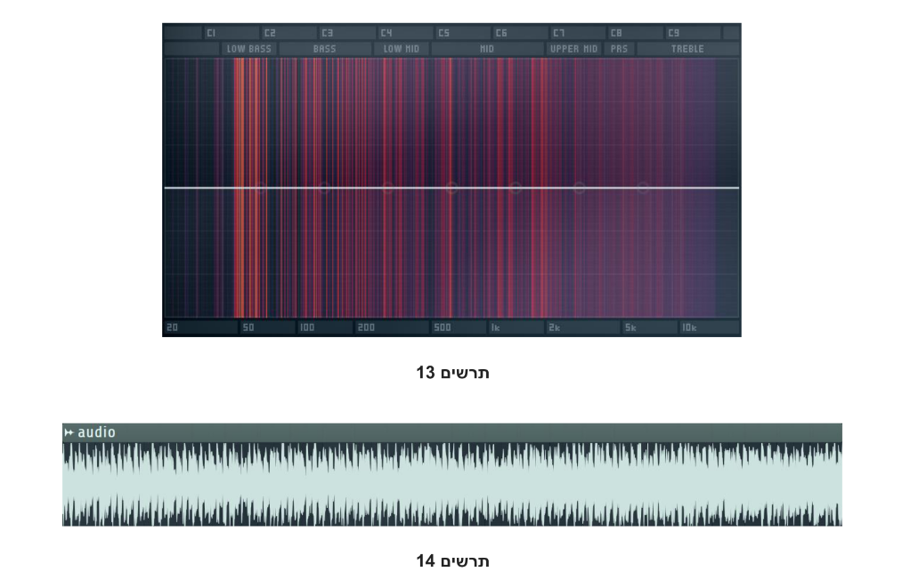
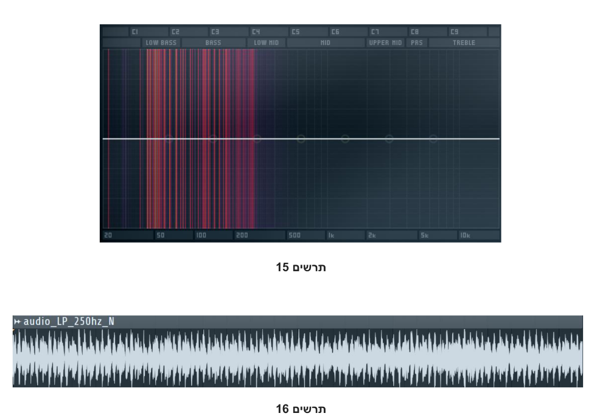

# BeatSync 5.0

BeatSync was a final project of mine at the college of Kfar Hayarok, 2018. It was an attempt of mine to go all out on a project which combined a bunch of things I liked and a bunch of things I wanted to learn into one - code, music (Digital Signal Processing) and hardware (Arduino).

## Architecture

  

BeatSync synchronizes the songs being played in your earphones during a run with your heartbeat. The idea is that BPM (beats per minute) is a unit of measurement used in songs as well as in heartbeat. Normally, the human heartbeat sits at about 60-70 BPM, but increases when performing physical activities and actually falls in the same value range as most EDM songs. Therefore, they can be synchronized. 

The project consists of 4 main pillars:

- Hearbeat sensor and bluetooth receiver connected to an Arduino controller
- WAV codec
- BPM calculator algorithm
- Phone app

  
  

The __phone app__ is paired with the __bluetooth receiver__ which can transfer data from the __hearbeat sensor__ through the Arduino controller. The app also finds all the files with `.wav` extension in the phone's music folder, passes them through the __codec__, calculates the BPM of the song using the __BPM calculator algorithm__ and stores the calculation aside. All songs are now a part of the playlist and can be managed and previewed through the phone app. During the run, the new song is picked based on the closest match with the current heartbeat. It is then introduced by fading it in (right before the most active part of the song) and fading out the old one.

  

Different age groups have different valid hearbeat BPM ranges. For instance, a BPM of 160 is okay for someone which is 20 years old, but unhealthy for someone who is 60 year old. Application keeps track of the user's age and in case the BPM exceeds the range - notifies the user and stops the music.

  

The BPM algorithm is based around the concept of filters in audio. The idea is that the beat is what defines the BPM of the song and typically falls in the bass range. Audio can be passed through a __lowpass__ filter which filters any frequency above a certain threshold, in our case, anything above the bass range. Audio can then be __normalized__ (brought to its maximum value without distorting the audio) so peaks (which are presumably drum beats) can be easily recognized. A repeated pattern can be found and BPM can be calculated from time difference. A lowpass filter can be built using Fourier Transform - a commonly used function in Digital Signal Processing. In DSP, it is used to convert audio from __time domain__ to __frequency domain__ exposing the frequencies for editing. The edited frequencies can be converted back to time domain using Inverse Fourier Transform. Here is an example audio in frequency and time domains:

  

Here is the same audio passed through a lowpass filter:

  

## Downsides

Now, the app __does__ work more or less. This all sounds cool and all, but falls in many ways. I wrote the project while only having some experience in C#, without having to write any production code before. Code versioning is non-existent - the only reason this version is 5.0 is because every time I wanted a new version, I just initialized a new project in Visual Studio with the new name. The app only recognizes the specific bluetooth adapter used by me during testing. The WAV codec can do just that - read and write WAV files. It barely even achieves that - some WAV files which include metadata can outright crash the app. The filter implementation is very amateurish and peak detection is unreliable. Overall there is room for improvement.

## What do?

You could, for instance, rewrite the entire project in Go, create a more mature codec which accepts multiple formats, write an overall better app with proper lowpass filter and peak detection. And this is what I am currently working on. The entire project will be split into separate repositories for modularity and once sizable progress is made, I will link them here. For now, you are able to follow the progress by finding the repos on my GitHub page.

Cheers.
